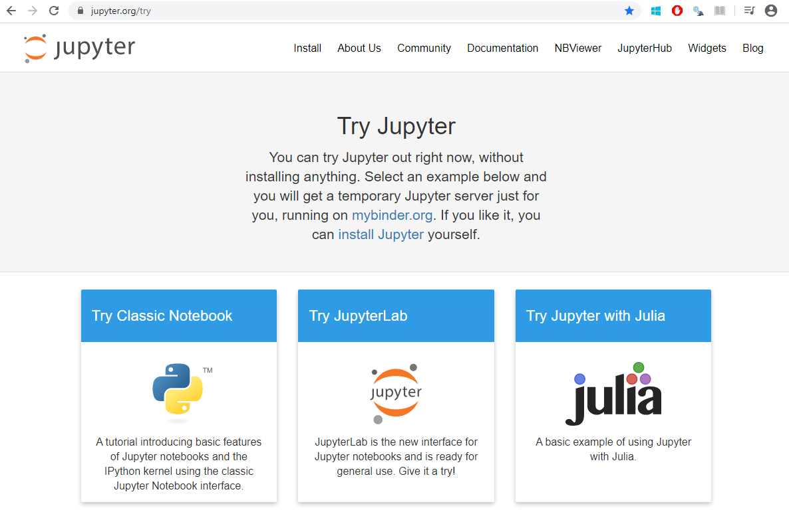

# Probando Jupyterlab: Métodos de Clustering

En esta demo, vamos a dar un vistazo a JupyterLab. Usaremos la versión online, así que no necesita instalar nada previamente para poder replicar esta demo.

Vamos a explorar diferentes técnicas de Clustering, utilizando como referencia un notebook elaborado por Abdul Meral [1], que a su vez, está basado en otro instructivo muy detallado [2], desarrollado por el gran Jason Bronwnlee, autor de varios libros de la colección 'Machine Learning Mastery'.

## Iniciando JupyterLab

Vaya a https://jupyter.org/try y seleccione la opción de JupyterLab online

## Descargar Kaggle Notebooks y Datasets

Usted puede descargar manualmente los notebooks y datasets de Kaggle. Sin embargo, también puede utilizar una librería para importar y exportar información utilizando códigos.

Lo primero, es instalar utilizando la Terminal:

    $ conda install -c conda-forge kaggle

Al finalizar, es necesario generar una clave desde Kaggle para conectarse. Hay un instructivo [3] en la sección de Referencias, al final de este documento. 

Arrastre la clave descargada al home de JupyterLab. Para copiarla en la carpeta correcta, puede utilizar los siguientes comandos:

    $ cp kaggle.json ~/.kaggle/kaggle.json
    $ chmod 600 ~/.kaggle/kaggle.json

Ya estamos listos para copiar elementos desde cualquier página de Kaggle, utilizando las sintaxis adecuadas. En nuestro caso, vamos a copiar un notebook de ejemplo, en el que se describen diferentes alternativas para utilizar algoritmos de clustering.

    $ kaggle kernels pull abdulmeral/10-models-for-clustering
    $ kaggle datasets download -d shwetabh123/mall-customers
    $ unzip Mall_Customers.zip

Finalmente, podemos replicar el procedimiento indicado en el Notebook para entender mejor ciertos algoritmos de Clustering. Sólo es necesario modificar el código que se utiliza para importar el archivo.

## Complementando el Análisis con NbClust de R

Una vez que hemos revisado los algoritmos de Clustering en Python, vamos a utilizar la librería NbClust [4] para ver cómo testear distintos algoritmos y métricas de Clustering en R.

El primer paso es instalar la librería NbClust, utilizando la Terminal

    $ conda install -c conda-forge r-nbclust

Luego, abrimos un notebook de R y empezamos invocando las librerías que vamos a utilizar:

    library(NbClust)
    library(ggplot2)

Leemos el dataset:

    data<-read.csv("Mall_Customers.csv")

Revisamos los primeros registros

    head(data)

Reemplazamos los nombres:

    names(data)[4:5]<-c('AnnualIncome','SpendingScore')

Y probamos construyendo una serie de escenarios, en los que se ejecutan distintas segmentaciones, para determinar la cantidad óptima de clusters.

    NbClust(data[,c(4,5)], diss=NULL, distance="euclidean", min.nc=4, max.nc=12, method="kmeans", index="all")

Luego de revisar los resultados, podemos almacenar los resultados para graficar los clusters

    nbclu<-NbClust(data[,c(4,5)], diss=NULL, distance="euclidean", min.nc=4, max.nc=12, method="kmeans", index="all")

Combinamos la información del dataset con la etiqueta de clusters que viene de NbClust

    data<-cbind(data,'cluster'=nbclu$Best.partition)

Y podemos graficar la distribución:

    ggplot(data, aes(x=AnnualIncome, y=SpendingScore, shape=cluster, color=cluster)) + geom_point()

Podemos seguir cambiando y eligiendo otras distiancias, métodos y métricas para encontrar la que mejor se adecúe a nuestros datos. Del mismo modo, podemos aprender más sobre las catacterísticas de JupyterLab, a través de un VideoTutorial [5] o de la documentación correspondiente.

    

## Referencias

[1] [Kaggle: 10 Models for Clustering](https://www.kaggle.com/abdulmeral/10-models-for-clustering/)

[2] [ML Mastery: 10 Clustering Algorithms With Python](https://machinelearningmastery.com/clustering-algorithms-with-python/)

[3] [ConfusedCoders: How to copy Kaggle data to Amazon S3](https://confusedcoders.com/data-engineering/how-to-copy-kaggle-data-to-amazon-s3)

[4] [NbClust Package For Determining The Best Number Of Clusters](https://www.rdocumentation.org/packages/NbClust/versions/3.0/topics/NbClust)

[5] [VideoTutorial: Introducción a JupyterLab en menos de 4 minutos](https://www.youtube.com/watch?v=tdSVdcFezqs)
