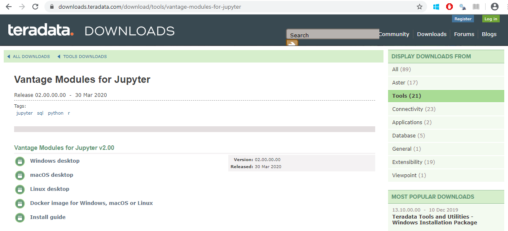

# Download JupyterLab

[Video in Youtube](https://www.youtube.com/watch?v=0uiz73pFvqY)  

In order to download the JupyterLab image released by Teradata, go to the following link:

https://downloads.teradata.com/

If you don't have an account, you need to register before you can download the image. Don't worry about your personal data, Teradata will not pass it on to third parties or fill your spam tray. In fact, the email you declare only serves to enter the download website.

Verify your account using the email message. Remember your username and password, you will need them every time you want to enter to download more components.

IMPORTANT: Remember that the username is not your email.

When you have logged in with your account, enter the download website:

https://downloads.teradata.com/download/tools/vantage-modules-for-jupyter

We are going to use the image for Docker, but you could install JupyterLab directly in your operating system using the corresponding versions of the installer.

To download the image, you must click on the correct link. A window will open with a license agreement. After reviewing it, go to the final part of the document and accept. The download will start automatically.

When the download is complete, move the file to a location where you can use it in the configuration steps.
